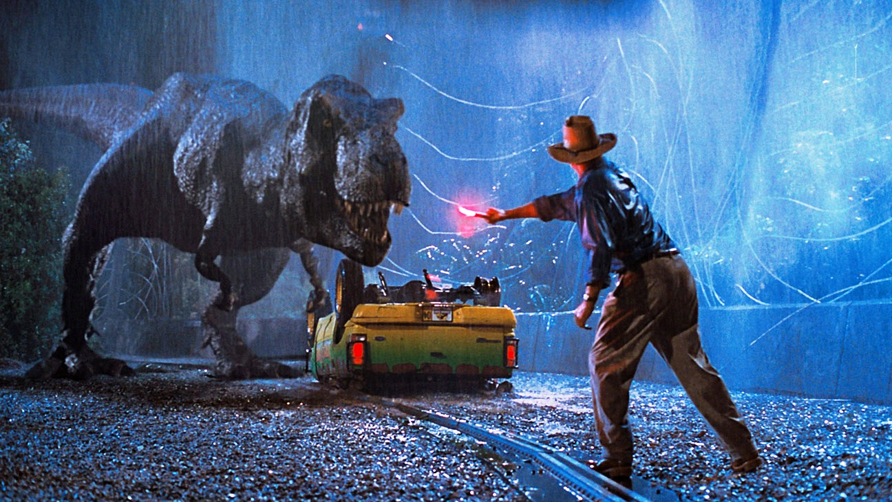

```{r setup, include=FALSE}
options(htmltools.dir.version = FALSE)
knitr::opts_chunk$set(collapse = TRUE,
                      fig.retina = 3)

library(ymlthis)
library(tidyverse)
```

layout: true

---

class: title-slide, center, bottom

# `r rmarkdown::metadata$title`

## `r rmarkdown::metadata$subtitle`

### `r rmarkdown::metadata$author`

---
name: clouds
class: center, middle
background-image: url(images/Clouds.jpg)
background-size: cover

```{r meta, echo=FALSE}
library(metathis)
meta() %>%
  meta_general(
    description = "30 min talk to graduate programs in animal ecology and paleontology in UFSM",
    generator = "xaringan and remark.js"
  ) %>% 
  meta_name("github-repo" = "GabrielNakamura/presentation-UFSM") %>% 
  meta_social(
    title = "Contando Histórias em ecologia: um olhar para o passado para compreender padrões atuais de biodiversidade",
    url = "",
    image = "",
    image_alt = "The first slide features the presentation tile with a figure centered on the top illustrating an antique world map",
    og_type = "website",
    twitter_card_type = "summary_large_image"
  )
```

???
Thank you everyone for the presence. Im gonna briefly present the work that Ive been developing as a postdoctoral research here at Texas A&M, as Barnabas said Im a postdoc here under his supervision. So, today I will talk a bit about community phylogenetics, macroevolution, biogeography and possible ways to integrate those three different, but very related fields. Before start talk about those exciting topics I would like to talk about another topic that is subject that is apparently far from our field of ecology but are more related than we imagine that is...

---
template: clouds

## Viagem no tempo

???
So, time travels are one of the most fascinating ideas and arouse a lot of attention from us.


---

name: clouds
class: center, middle
background-image: url(images/Clouds.jpg)
background-size: cover

## Viagem no tempo

.pull-left[
```{r echo=FALSE, out.width="60%", fig.alt= "Cover page from Wonderful life book"}
 knitr::include_graphics("images/Wonderful_Life_movie.jpeg")
```
]

.pull-right[
```{r echo=FALSE, out.width="60%", fig.alt= "Picture from the movie back to the future"}
 knitr::include_graphics("images/back_to_the_future.jpeg")
```
]

???
It populate our imaginary and is very present in our lives mainly through movies and some fancy speculations that explore this possibility 

---

## A importância do passado

.center[
.pull-left[
```{r echo=FALSE, out.width="60%", fig.cap="Tardis", fig.alt= "A a photo with a dog and white flour on the sofa. The dog is with his mouth full of flour"}
 knitr::include_graphics("images/tardis.png")
```
]
]

.midle[
.pull-right[
- **Curiosidade** 

- Compreensão de eventos atuais **baseado em eventos passados**

- Predizer possíveis **cenários futuros**

]
]

???
But, why we have such fascination about time travel topics? First, of all I believe that is a matter of intrinsically curiosity to discover something that is resembles a fiction history, imagine how incredible would be to travel in time inside the Tardis, the success of Dr. Who series reflect a little bit our fascination


---
## The importance of the past

.center[
.pull-left[
```{r echo=FALSE, out.width="100%", fig.cap="Jurassic Park 1", fig.alt= "A a photo with a dog and white flour on the sofa. The dog is with his mouth full of flour"}
 
```
]
]

.midle[
.pull-right[
- **Curiosidade**

- Compreensão de eventos atuais **baseado em eventos passados**

- Predizer possíveis **cenários futuros**

]
]

???
Other reasons are, and much more reliable by the way, are that through the knowledge of past events we can understand better our present reality, and sometimes we can predict with more confidence what will happen in the future..


---
name: clouds
class: center, midle
background-image: url(images/Clouds.jpg)
background-size: cover

## Ecologia como uma ciência histórica

```{r echo=FALSE, out.width="30%", fig.alt= "A a photo with a dog and white flour on the sofa. The dog is with his mouth full of flour"}
 
```

???
And at this point that history meets Ecological research. Ecology is a historical science, as Gould pointed in his amazing book Wonderful Life.

---
name: clouds
class: center, midle
background-image: url(images/Clouds.jpg)
background-size: cover

## Evolução como uma ciência histórica

.pull-left[
```{r echo=FALSE, out.width="60%", fig.alt= "A a photo with a dog and white flour on the sofa. The dog is with his mouth full of flour"}
 
```
]

.pull-right[
- A **Natureza da história**

- O **papel da história** em moldar padrões de biodiversidade

- **Fósseis** como uma janela pro passado
]

???
Historical events matters a lot if we want to understand the current forms and distributions of life on earth
 
---
name: clouds
class: center, midle
background-image: url(images/Clouds.jpg)
background-size: cover

## Ecologia como uma ciência histórica - padrões biogeográficos

.pull-left[
```{r echo=FALSE, out.width="60%"}


```

```{r echo=FALSE, out.width="100%"}

knitr::include_graphics("images/pyron_geb.png")

```


]

.pull-right[
.center[
.middle[

- A importância de  **eventos históricos em padrões biogeográficos**

- **História biogeográfica** como explicação para padrões

]
]
]

???
And actually the importance of historical events has been acknowledge, but mainly in a macroecological scale. For example, to understand how speciation and historical dispersal events shape macroecological patterns or regionalization schemes

---
name: clouds
class: center, midle
background-image: url(images/Clouds.jpg)
background-size: cover

## Ecologia como uma ciência histórica - padrões macroevolutivos

.pull-left[

```{r echo=FALSE, out.width="80%"}

knitr::include_graphics("images/fossil.jpeg")

```

]

.pull-right[
.center[
.middle[

- **Fósseis** como fotografias do passado

- Nem sempre disponíves, ou muito **fragmentados**

]
]

]

---
name: clouds
class: center, midle
background-image: url(images/Clouds.jpg)
background-size: cover

## Ecologia como uma ciência histórica - padrões macroevolutivos

.pull-left[

```{r echo=FALSE, out.width="55%"}


```

]

.pull-right[
.center[
.middle[

- **Modelos macroevolutivos** como fotografias do passado

- Evidências temporais, mas e o **espaço geográfico**?
]
]

]

---
name: clouds
class: center, midle
background-image: url(images/Clouds.jpg)
background-size: cover

## Como entender o efeito de processos históricos em comunidades?

.pull-left[


```{r echo=FALSE, out.width="90%", fig.alt= "A black and white family album."}
 
```

]


.pull-right[

- Padrões atuais de biodiversidade apresentam **imprints do passado**

]


???
But, at a more local scale, for example, assemblage scale, how can we understand the effects of deep past events like speciation and dispersal to shape patterns that we see at local scale. One proposed solution to do this is to characterize the phylogenetic structure of communities or assemblages, and, patterns regarding phylogenetic metrics in those local communities will express the imprints of different processes acting on the assembly processes of those communities

---
name: clouds
class: center, midle
background-image: url(images/Clouds.jpg)
background-size: cover

## Como entender o efeito de processos históricos em comunidades?

.pull-left[


```{r echo=FALSE, out.width="100%", fig.alt= "A black and white family album."}
 knitr::include_graphics("images/end_day.jpg")
```

]


.pull-right[

- Padrões atuais de biodiversidade apresentam **imprints do passado**

- Padrões **ambíguos** - uma evidência, muitos processos

]

---
name: clouds
class: center, midle
background-image: url(images/Clouds.jpg)
background-size: cover

## Como podemos entender o efeito da história em comunidades?

### mesmo padrões, histórias diferentes

```{r echo=FALSE, out.width="65%", fig.alt= "A black and white family album."}
 
```

???
But rely only on current patterns of phylogenetic structure of assemblages does not guarantee that we will able to detect the imprints of those historical processes. This is a classical example of three different scenarios that can produce the same patterns of current phylogenetic structure. If we had a Tardis machine to see where the ancestors of species came from we can see that a different combination of speciation and dispersal can produce the same pattern

---
name: clouds
class: center, midle
background-image: url(images/Clouds.jpg)
background-size: cover

## Como podemos entender o efeito da história em comunidades?

### Resumindo

```{r echo=FALSE, out.width="65%", fig.alt= "Herodotools fig1 picture"}

```


---
name: clouds
class: center, midle
background-image: url(images/Clouds.jpg)
background-size: cover

## How can understand the effects of deep past shaping biodiversity in ecological communities?

<div class="flex" style="margin: 0 1em;">
  <div class="column">
    <h3> Arcabouço teórico integrado </h3>
    
  </div>

--

<div class="flex" style="margin: 0 1em;">
  <div class="column">
    <h3> Ferramentas numéricas </h3>
    
  </div>  

---
name: clouds
class: center, midle
background-image: url(images/Clouds.jpg)
background-size: cover

## Como detectar o efeito de processos históricos na estrutura de comunidades?

### Ferramentas


.pull-left[

- Como compreender o efeito de eventos de diversificação in-situ e eventos ex-situ (ex dispesão)?

- modelos macroevolutivos para estimativa de **area ancestral**

- **decompor**  a história evolutiva em eventos **in situ** e **ex-situ**
]

???
Basically, the diversity metrics measured at local or regional scales cannot differentiate between processes associated with dispersal and diversification. So, we could first, estimate the range of species through ancestral area reconstruction, and based on this reconstruction we can decompose the evolutionary history of set of species based on the amount of this evolutionary history that emerged from dispersal events, and the amount of evolutionary history that emerged from diversification processes

---
class: inverse, center, middle

# A solução
```{r echo=FALSE, eval=TRUE, out.width="40%"}
knitr::include_graphics(path = "images/logo_herodotools.png", dpi = 700)
```

???
Here we can see that looking at just the traditional metrics we can see that we take the risk to underestimate the role of amazon assemblages in maintain through time the phylogenetic endemism for these bird assemblages. Since Amazon corresponds to a region in which the phylgoeentic endemism is almost all genereted through in-situ speciation

---
name: clouds
class: center, midle
background-image: url(images/Clouds.jpg)
background-size: cover

# Como ligar processos históricos com padrões atuais de biodiversidade

.center[
```{r echo=FALSE, out.width="65%", fig.alt= "A painting illustrating Darwin's finches" }

```
]


???
So, the question is, if the metrics of phylogenetic diversity cannot offer a reliable interpretation of past events shaping biological assemblages, how can we consider the evolutionary history acting in different scales, particularly a regional/local scale?


---
name: clouds
class: center, midle
background-image: url(images/Clouds.jpg)
background-size: cover


## Ligando padrões atuais e processos históricos

### Idade de comunidades

```{r echo=FALSE, out.width="70%", fig.alt= "a plate with multiple maps showing the proportion of dispersal of each region" }

```

???
In a closer look we can see how much each biome contributes as a source of species to other biomes, for example, the Amazon biome contribures mainly as a source of species to biomes in the central america 

---
name: clouds
class: center, midle
background-image: url(images/Clouds.jpg)
background-size: cover

## Ligando padrões atuais e processos históricos

### Padrões de diversificação in situ

```{r echo=FALSE, out.width="75%", fig.alt= "A painting illustrating Darwin's finches" }

```

---
name: clouds
class: center, midle
background-image: url(images/Clouds.jpg)
background-size: cover

## Ligando padrões atuais e processos históricos

### Padrões de dispersão histórica

```{r echo=FALSE, out.width="75%", fig.alt= "A painting illustrating Darwin's finches" }

```

---
name: clouds
class: center, midle
background-image: url(images/Clouds.jpg)
background-size: cover

## Ligando padrões atuais e processos históricos

### Medidas em ecologia filogenética de comunidades

```{r echo=FALSE, out.width="75%", fig.alt= "A painting illustrating Darwin's finches" }

```

---
name: clouds
class: center, midle
background-image: url(images/Clouds.jpg)
background-size: cover

## Ligando padrões atuais e processos históricos 

### Dinâmica macroevolutiva de atributos em comunidades

```{r echo=FALSE, out.width="75%", fig.alt= "A painting illustrating Darwin's finches" }

```

---
name: clouds
class: center, midle
background-image: url(images/Clouds.jpg)
background-size: cover

## Ligando padrões atuais e processos históricos 

### Outras funcionalidades

.pull-left[

```{r echo=FALSE, out.width="75%", fig.alt= "A painting illustrating Darwin's finches" }

```

]

.pull-right[
- Definição de **evoregiões** (Duarte e Maestri)

- Manipulação de dados de **reconstrução** (BioGeoBEARS) 

- Outras medidas de **ecologia filogenética de comunidades** (PDinsitu)
]

```{r echo=FALSE, out.width="75%", fig.alt= "A painting illustrating Darwin's finches" }

```

---
name: clouds
class: center, midle
background-image: url(images/Clouds.jpg)
background-size: cover

## Herodotools - contando Histórias em ecologia

### biogeografia + macroevolução + ecologia de comunidades

```{r echo=FALSE, out.width="35%", fig.alt= "A painting illustrating Darwin's finches" }
  
```

---
name: clouds
class: center, midle
background-image: url(images/Clouds.jpg)
background-size: cover

.pull-right[

 

